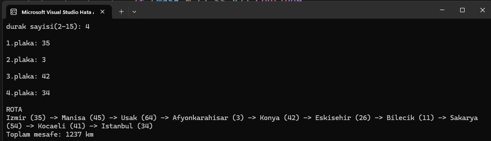

# Turkey Route Optimizer in C

## Project Overview

Turkey Route Optimizer is a graph-based route planning system developed in C. The project represents 81 Turkish cities as nodes and road connections as weighted edges.

The system loads city and road information from external files and calculates optimal routes between multiple locations. Shortest path calculations are performed using Dijkstra's algorithm, while route optimization between multiple stops is achieved through a dynamic programming approach inspired by the Traveling Salesman Problem (TSP).

---

## Features

- Graph representation using adjacency lists
- Loading city and road data from external files
- Dijkstra's shortest path algorithm
- Multi-stop route optimization
- Dynamic Programming based route planning
- Real route reconstruction
- Distance calculation between Turkish cities
- Route visualization through city names

---

## Algorithms Used

### Dijkstra Algorithm

Used to calculate the shortest path between cities in the graph.

### Dynamic Programming (TSP-Inspired)

A dynamic programming approach inspired by the Traveling Salesman Problem (TSP) is used to determine the optimal order of multiple intermediate stops while minimizing the total travel distance.

### Graph Data Structures

The map of Turkey is represented as a weighted graph using adjacency lists.

---

## Project Structure

```text
main.c
cities.txt
roads.txt
```

- `main.c` : Main application and algorithms
- `cities.txt` : Turkish city information
- `roads.txt` : Road and distance data

---

## Example Usage

1. Enter the number of stops.
2. Enter city plate numbers.
3. The program calculates the optimal route.
4. The complete route and total distance are displayed.

Example:

```text
Stops:
35
3
42
34

ROUTE

Izmir (35) -> Manisa (45) -> Usak (64) -> Afyonkarahisar (3) -> Konya (42) -> Eskisehir (26) -> Bilecik (11) -> Sakarya (54) -> Kocaeli (41) -> Istanbul (34)

Total Distance: 1237 km
```

---

## Sample Output



---

## Technologies

- C Programming Language
- Graph Data Structures
- Dijkstra Algorithm
- Dynamic Programming
- File Handling
- Adjacency Lists

---

## Author

Bengisu


